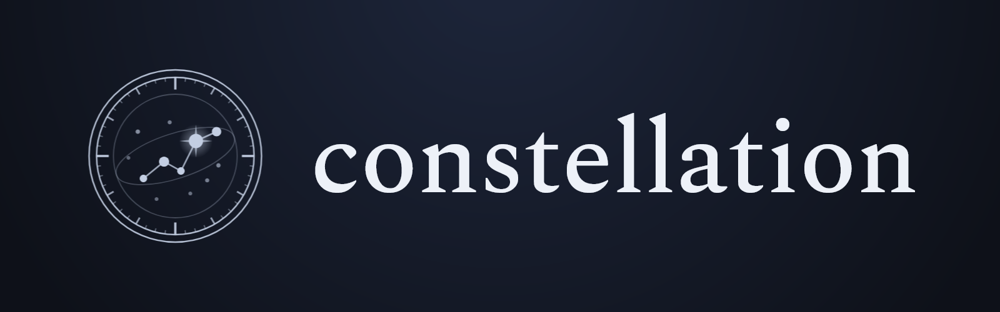

<p align="center"></p>

# constellation

A cross-project knowledge graph of Django codebases, served to an LLM coding agent over MCP. constellation parses Python and Django into a graph of symbols, imports, calls, and Django structure such as models, URL routes, and templates. It links those graphs across separate repositories and answers an agent's questions about how your projects connect.

## Why it exists

An agent exploring a codebase without an index spends most of its budget on grep and file reads, and it typically sees one repository at a time. A Django project of any size installs shared packages that live in their own repositories (`django-spire`, `django-glue`, `robit`, and `dandy` are the ones constellation was built against), and a single request crosses those boundaries. A per-repo index cannot show those edges, and grep cannot follow them across repositories at all.

`constellation` builds the graph once and links it across repositories, so an agent can trace a flow that leaves one repo and lands in another, and answer in a single query what would otherwise be a grep-and-read hunt across several checkouts.

## Install

Windows:

    winget install stratusadv.constellation

Linux (x86_64), one command:

    curl -fsSL https://raw.githubusercontent.com/stratusadv/constellation/main/assets/install.sh | sh

That fetches the latest release, verifies its checksum, puts the binary in `~/.local/bin`, appends that directory to your shell's startup file so it stays on `PATH`, and runs `constellation install`. Set `CONSTELLATION_INSTALL_DIR` to install somewhere else. The script is [assets/install.sh](assets/install.sh), short enough to read before piping it to a shell, and the same four steps by hand are:

    curl -LO https://github.com/stratusadv/constellation/releases/latest/download/constellation-x86_64-unknown-linux-gnu.tar.gz
    tar -xzf constellation-x86_64-unknown-linux-gnu.tar.gz
    install -Dm755 constellation-x86_64-unknown-linux-gnu/constellation ~/.local/bin/constellation
    ~/.local/bin/constellation install

The Windows installer registers the MCP server for you; on Linux that last line does it. Either way the server is registered with Claude Code, Codex, and OpenCode, and Grok Build discovers the configured server on its own. By hand, make sure `~/.local/bin` is on your `PATH`. Then index each repository:

    constellation init

Your agent picks up the graph the next time it starts. While `serve` is running it watches your files and re-indexes and re-links automatically, so the graph stays current as you work. Run `constellation sync` for a manual one-shot refresh, or `constellation init` again after large changes.

Update:

    winget upgrade stratusadv.constellation

On Linux, run the same install command again. It renames the new binary into place rather than writing over the old one, so a `serve` already running keeps its own copy and the replacement is picked up the next time a client starts one. The published binary links against glibc 2.35, so it runs on Ubuntu 22.04+, Debian 12+, Fedora 36+, and anything newer; on an older or musl-based distribution, build from source instead.

## What it indexes

- Python 3.11 and 3.13: symbols, imports, calls
- Django 5 and 6: models and fields, URL routes, views, template inheritance and render targets
- JavaScript and Alpine.js, including Alpine `x-data` handlers
- Links across repositories

## Commands

| Command | Purpose |
|---|---|
| `constellation init [--no-hooks]` | Create and index `.constellation/index.db` in the current repo, with a starter config and a Claude Code search hook ([docs](docs/hooks.md)) |
| `constellation sync [db]` | Re-index every project from disk and re-link, in one shot |
| `constellation link <db> <repo>...` | Index several repos into one shared graph and link them |
| `constellation serve [db] [--supervise]` | Serve the graph over MCP (stdio) and watch for changes; registered automatically by install. `--supervise` proxies a replaceable worker so a rebuild reaches a live session without reconnecting |
| `constellation history [db] [--symbols]` | Ingest git history so the graph can be read over time |
| `constellation flows [db] [--project id] [--depth n] [--include-tests]` | Trace and rank every Django execution flow |
| `constellation install [--no-hooks]` / `uninstall` | Register or unregister the MCP server with your agents. Run from inside an indexed repo it also registers that repo's search hook, unless `--no-hooks` |

`serve` keeps the graph current on its own: while it runs, a background watcher re-indexes and re-links every project on each change, so you rarely need `sync` by hand. Both `serve` and `sync` find the database by walking up from the working directory, or from the `CONSTELLATION_DB` environment variable.

`history` and `flows` populate derived data the query tools degrade gracefully without: a tool that needs one and does not have it says which command to run rather than answering as though the data were empty. `changed` goes further and renormalizes its risk score around whatever is missing, noting what it scored blind.

## Execution flows

`explore`, `feature`, and `path` are all anchored: you must already know a symbol to ask. Flows invert that.

    constellation flows

This detects every framework entry point Django can dispatch (a URL route, a DRF view, a management command, a Celery task, a signal receiver, an admin action, an `AppConfig.ready` hook, a model `save`/`delete`/`clean` override, or a true root), traces the bounded set of symbols reachable from each, and scores it for criticality. Two questions then become single lookups:

- `flows` lists every execution path ranked by criticality, with no symbol named first.
- `affected_flows` takes your working-tree diff and names the user-facing flows it touches.

Criticality blends the entry kind, how many apps the reach set spans, how much of it is security-sensitive, how much is untested, how many repositories it crosses, how often it leaves the graph, and its depth.

Detection is precise rather than heuristic: constellation already indexes routes as first-class nodes and carries `routes_to`, `renders`, `receives`, `handles`, and `admin_of` edges, so there is no regex over decorator source anywhere in the pass.

## Measuring retrieval quality

The benches under `crates/*/benches` measure how fast constellation is. `crates/eval` measures whether it answers *better*:

    cargo run -p constellation-eval -- --config eval/configs/<repo>.toml

Seven benchmarks over a version-controlled goldset: search quality (mean reciprocal rank, measured separately through plain search and through `explore`'s ranking), multi-hop questions, impact accuracy in two ground-truth modes, token efficiency, an agent baseline that scripts a grep-and-read loop for comparison, flow completeness, and index shape.

Every report ends with a **Limits** section stating what the run did not measure. Read it before quoting a number: the goldset is authored by the same people who wrote the ranking, token counts are a four-bytes-per-token approximation, and one of the impact modes is circular by construction and says so in its own column.

## Companions

Most requests cross into the shared packages a project installs (`django-spire`, `django-glue`, `robit`, `dandy`). On `init`, constellation finds those packages in the project's virtual environment, indexes each as its own project, and links the imports across the boundary, so the agent can follow a call from your code into the library and back.

`init` writes a starter `.constellation/config.toml` you can edit:

```toml
[companions]
enabled = true
packages = ["django-spire", "django-glue", "robit", "dandy"]
# venv = ".venv"
```

A local working copy wins over the installed copy. If your `pyproject.toml` pins a package to a path under `[tool.uv.sources]`, or a `development.env` / `.env` sets `PYTHONPATH_APPEND` to a directory holding it, that working copy is indexed in place of the `.venv` version, because it is what actually runs.

### Comparing versions

While refactoring a shared library, index other git refs of it alongside the installed one to compare old and new:

```toml
[companions]
versions = { django-spire = "refactor/next", django-glue = "v1.2.0" }
```

Each `"package@ref"` is checked out from the package's own repository (its editable checkout, or the git url pip recorded) into `.constellation/sources/`, and indexed as a separate project (`django-spire@refactor/next`) rooted exactly like the `.venv` copy, so only the version suffix differs. These copies are reference-only: your code still resolves to the installed version, and you query the extra ones to compare. This needs the library installed editable or from git, so a repository exists to take other refs from.

### Library history

Reading history over time (`history`, `symbol_history`, `as_of`) needs a git repository. A library installed as a wheel in `.venv` has none, so give constellation each library's repository and it fetches the history at the tag matching the installed version, no local clone, no version drift:

```toml
[companions.repositories]
django-spire = "https://github.com/your-org/django-spire"
```

The clone is cached under `.constellation/sources/`, so the network is used only the first time (or when the installed version changes). If no tag matches the installed version, that library's history is skipped rather than shown at the wrong version.

## How your agent uses it

Once a repo is indexed, the agent queries the graph instead of grepping: project overview, symbol search, source exploration, callers and callees, change impact, a model's effective schema, routes, execution flows, and cross-project links, all sub-millisecond.

A few tools are worth knowing by name:

- **`changed`** ranks the symbols your diff touched by review risk, highest first, with the two or three reasons behind each score. Missing tests, a security-sensitive name, participation in a critical flow, fan-in, cross-app and cross-repository callers, recent churn, and how much of the symbol changed.
- **`affected_flows`** answers "what can this diff break for a user" from the graph.
- **`winnow`** composes filters that would otherwise be four tool calls and a manual intersection: models with a foreign key to `Order`, changed in the last thirty days, with no covering tests.

Every listing tool that can truncate now offers a `cursor=` to page into the tail rather than only telling you to narrow. A cursor carries the index generation, so one taken before a mid-session re-index is reported expired rather than silently paging a shifted result set.

Symbol lines carry a working-tree marker: ` [M]` modified, ` [A]` added, ` [D]` deleted, ` [?]` untracked, and nothing at all for a clean file. The state comes from a snapshot a background worker refreshes, never from `git status` on the query path.

## Build from source

The Rust toolchain is the only requirement. Build automation lives in the workspace as a Rust binary, so there is nothing else to install:

    cargo xtask install
    ~/.local/bin/constellation install

`cargo xtask install` builds the release binary and places it in `~/.local/bin`, overridable with `CONSTELLATION_INSTALL_DIR`. Register that copy rather than the one in `target/`, as the second line does.

Installing to a stable directory keeps the file your agents launch separate from the file `cargo build` rewrites. Windows refuses to overwrite an executable that a running MCP server holds open, so a plain rebuild fails to link mid-session; the task renames the locked file aside and links again.

Install registers `serve --supervise`, which is what makes `cargo xtask install` the whole edit-test loop. An MCP client owns the process it spawns and reads the tool list once, so a new binary would normally mean reconnecting by hand. Under `--supervise` the process the client holds is a proxy: it starts a worker from the installed path, and when that path changes it starts the replacement, hands it the initialize exchange plus anything the retired worker never answered, and announces the new tool list. A build that cannot run is refused and the running worker keeps serving; a worker that dies is replaced and its caller still gets an answer. Nobody reconnects.

`cargo xtask probe [tool] [json]` calls one tool on the built binary and prints what an agent would see, which is how to check an edit without involving a client at all:

    cargo xtask probe explore '{"query":"Order order_number"}'

Set `CONSTELLATION_DB` to point it at a real project's graph, since the constellation checkout has no Django index of its own.

The other tasks are `cargo xtask build` (release build alone) and `cargo xtask tidy` (the style ratchets CI enforces). [ARCHITECTURE.md](ARCHITECTURE.md) is the map of the crates and the boundaries between them; read it before changing anything structural.

## License

MIT. See [LICENSE](LICENSE).
